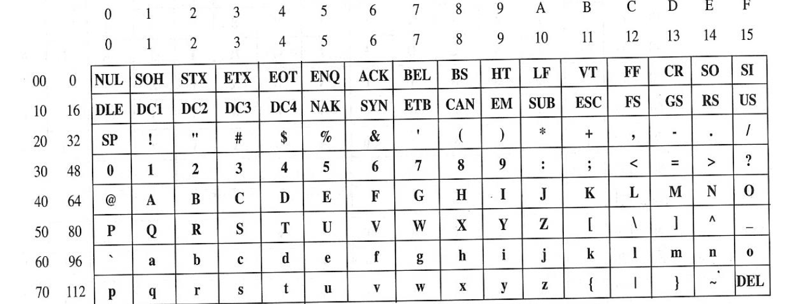

# Sesión     1.1.  Representación de la información

## Temporización   
  2.5 horas (no presenciales)

## Objetivos formativos     
  - Conocer y saber utilizar los principales sistemas empleados por las computadoras para la codificación de la información textual y numérica.

- Transformar números en base 10 a otra base de numeración y a la inversa. Realizar operaciones básicas en un sistema de numeración de cualquier base (binario, octal, hexadecimal,…).
- Conocer los sistemas estándar de representación de texto (ASCII, Unicode) y codificar/decodificar la información textual.
- Diferenciar las dos formas posibles de representación de la información numérica: textual y en base a un sistema de numeración. Diferenciar entre números enteros y reales en términos de representación numérica.
- Conocer las diferentes formas de representación numérica de los datos enteros con signo. Calcular el rango de valores admitido en función del tamaño de la representación. Codificar/decodificar valores enteros en cualquier representación.

- Conocer el estándar IEEE 754 para la representación numérica de valores reales. Diferenciar entre representación normalizada y de-normalizada. Codificar/decodificar valores reales en simple y doble precisión. Entender y calcular la precisión y los límites de la representación.

## Competencias a desarrollar     

- [X]     RD1: Poseer y comprender conocimientos
- [X]     RD2: Aplicación de conocimientos
- [X]     UAL1: Conocimientos básicos de la profesión
- [X]     UAL3: Capacidad para resolver problemas
- [ ]     UAL6: Trabajo en equipo
- [X]     FB3: Conocimientos básicos sobre el uso y programación de los ordenadores, sistemas operativos, bases de datos y programas informáticos con aplicación en la ingeniería.

## Materiales     
Sesiones de Grupo Docente 1.2 y 1.3 + Bibliografía tema 1 + Internet

## Tarea     

 Realizar los ejercicios propuestos.

 Compare los resultados de los ejercicios realizados con sus compañeros de clase y discuta con ellos posibles discrepancias. Si surgen dudas consulte con el profesor.

## Criterios de éxito     
- Terminar en el tiempo previsto la tarea.

- Demostrar, en una prueba escrita u oral, mediante las respuestas a las preguntas del profesor que ha alcanzado los objetivos formativos.

## Plan de trabajo     Actividad     Temporización
Estudio de los contenidos teóricos (GD 1.2 y 1.3). Puede simultanear esta actividad con la siguiente en especial cuando surjan dificultades en alguno de los ejercicios.     30 mn

Realizar los ejercicios propuestos.  120 mn

## Ejercicios
          
### **1**.   
  Cuántos bits hay en 32 KB? ¿Y en 64 MB?  ¿Y en 4 GB?

     RESPUESTA:

### **2**.
Una computadora tiene 36 K palabras de memoria principal (K informático, no decimal!!), y está estructurada en palabras de 32 bits? ¿Cuántos caracteres caben en dicha memoria?

     RESPUESTA:

### *3*.
Transformar a decimal los siguientes números:

|Tipo| |  |Respuesta|Respuesta|
|----|---|---|---|---|
|binarios:|10110 |0,10011|      |     |
|octales:|7354 |0,70612|        |     |
|hexadecimales:|F7398|0,758FA|   |     |

### **4**.
Transformar a binario los siguientes números:
|Tipo| |  |Respuesta|Respuesta|
|----|---|---|---|---|
|decimales:|525 |0,17|      |     |
|octales:|372 |0,0375|        |     |
|hexadecimales:|37F|0,0AC54|   |     |

### **5**.
Efectuar las siguientes operaciones binarias:
- 10011 + 11011  
  - RESPUESTA:          
- 11100 – 10001
  - RESPUESTA: 
- 1101 * 101
  - RESPUESTA:
- 1101 / 101 con tres decimales
  -   REPUESTA:      

   
### **6**.
Efectuar las siguientes operaciones aritméticas directamente en el sistema de numeración indicado:
- Base 8:     
  - 664 + 757,3
     - RESPUESTA: 
  - 375 – 177
       - RESPUESTA:
  - 453 * 3
      - RESPUESTA:
- Base 16:
  - A8900GC30 – FFD710
     - RESPUESTA:
  - 3F68 + 43B
     - RESPUESTA:
  - FA76 * CBA
     - RESPUESTA:

Ayuda: construir previamente las tablas de suma y de multiplicación para los diferentes sistemas de numeración. Ej: tablas de suma y multiplicación en hexadecimal:
 
 

### **7**.
Obtener los siguientes complementos:
-  a 10:        9375           (número decimal)
       - RESPUESTA:
-  a 9:          3798           (número decimal)
       - RESPUESTA:
-  a 2:          101111     1000        (número binario)
       - RESPUESTA:
-  a 1:          110111     1111101  (número binario)
     - RESPUESTA:

### **8**.
Efectuar las siguientes restas en la base indicada (1) directamente, (2) sumando al minuendo el complemento a la base menos 1 del sustraendo, y (3) sumando al minuendo el complemento a la base del sustraendo. Comparar los resultados obtenidos. Considerar representaciones de 8 cifras para todos los números.
 -     Decimal:          1748 – 547
       - RESPUESTA:
-     Binario:          111111 – 101111
     - RESPUESTA:
-     Octal:          1743 – 547
     - RESPUESTA:
-     Hexadecimal:     F8A4 – C9AA
     - RESPUESTA:
     - 
### **9**.
¿Cuántos bits se necesitarían como mínimo para codificar un conjunto de 108 caracteres?

- RESPUESTA:

### **10**.
En el sistema Unicode (norma de código único para caracteres mundiales), cada carácter es codificado utilizando 2 bytes, respetándose los códigos ASCII básicos, así como otros sistemas anteriores de codificación de caracteres. ¿Cuál es el máximo nº de caracteres diferentes que se pueden representar en Unicode? ¿Cuáles son los códigos hexadecimales en Unicode de los caracteres 'K' y 'Ñ', cuyos códigos decimales en ISO 8859-1 (ISO Latin-1) son 75 y 209 respectivamente?

### **11**.
Usando un editor de textos ASCII se ha creado y almacenado en el disco duro de la computadora un archivo de texto. A continuación, y mediante la herramienta adecuada, se visualiza su contenido sin decodificar, esto es, el conjunto de ceros y unos en que ha sido traducido el conjunto de caracteres escrito, para poder ser almacenado y manipulado por la computadora. Suponiendo la salida de la herramienta de visualización en hexadecimal, indicar cuál será el texto que se ha escrito si lo que aparece es: 31 2C 32 2C 33 0D 0A 45 53 54 4F 20 65 73 20 75 6E 61 20 70 72 75 65 62 61 2E.

- RESPUESTA:
 
### **12**.
¿Cuál es el significado de los siguientes caracteres ASCII: SOH, STX, ETX, ENQ, ACK, BEL, BS?

- RESPUESTA:

### **13**.
Suponiendo que una computadora utiliza n=8 bits para representar números enteros, ¿cómo se representarían internamente los siguientes números decimales: +100, -127, +255, -128? Considerar las siguientes representaciones:

- a) Signo y magnitud.     
  - RESPUESTA:
- b) Complemento a 1.     
  - RESPUESTA:
- c) Complemento a 2.      
  - RESPUESTA:
- d) Sesgada (desplazada).
  - RESPUESTA:

### **14**.
¿Cuáles serán los números decimales enteros correspondientes a los números siguientes: 10101110; 01111011; 10000000? Considerar las siguientes representaciones:
-  Sin signo.
     - RESPUESTA:
 - Signo y magnitud.
     - RESPUESTA:
 - Complemento a 1.
      - RESPUESTA:
 - Complemento a 2.
      - RESPUESTA:
 - Sesgada.
      - RESPUESTA:
 - BCD.
     - RESPUESTA:

### **15**.
En IEEE 754, precisión sencilla, indicar a qué números decimales corresponden los siguientes números: BC7E0000; 80000004; FF800000; 7FF80700

- RESPUESTA:

### **16**.
Suponiendo una computadora que utiliza el estándar IEEE 754, obtener las representaciones internas en simple precisión de los siguientes números: 7; -7.5 * 2-140

- RESPUESTA:

### **17**.
Obtener los números reales máximos y mínimos (normalizados y de-normalizados) representables en IEEE 754, doble precisión.

- RESPUESTA:
 

 
## Respuestas ejercicios 

1) 
   32 KB = 262 144 bits
     64 MB = 536 870 912 bits
     4 GB = 34 359 738 368 bits

2)   147 456 caracteres (bytes)

3)  
     (10110)2 = (22)10

     (0,10011)2 = (0,59375)10

     (7354)8 = (3820)10 

     (0,70612)8 = (0,88702392578125)10

     (F7398)16 = (1 012 632)10
     
     (0,758FA)16 = (0,4592227935791015625)10

 4)
     (525)10  = (1 000 001 101)2

     (0,17)10  = (0,0010101)2

     (372)8  = (11 111 010)2

     (0,0375)8  = (0,000 011 111 101)2

     (37F)16 = (11 0111 1111)2

     (0,0AC54)16 = (0,0000 1010 1100 0101 0100)2

5) 
    10011 + 11011 = 101110     
     11100 – 10001     = 1011     
     1101 * 101 = 1 000 001          
     1101 / 101 = 10,100                
     (1010,1001)1/2 = 11,01
6)
     Base 8:

          664 + 757,3 = 1643,3

          375 – 177 = 176

          453 * 3 = 1601

     Base 16:

          A8900GC30 – FFD710 (no válida -- G?)

          3F68 + 43B = 43A3

          FA76 * CBA = C7381BC

7)
     Números decimales:

     9375     C10 = 0625

     3798     C9 = 6201

     Números binarios:
     1 011 111 000            C2 = 0 100 001 000
     1 101 111 111 101       C1 = 0 010 000 000 010

8)     

|Sist. numeración |    Decimal |    Binario |    Octal |    Hexadecimal|
|----|---|----|---|---|
|Resta |  00001748 | 00000547 |    00111111| 00101111 |    00001743|
| | 00000547 |    0000F8A4|  0000C9AA|
|Directa |   00001201 |    00010000 |    00001174 |    00002EFA|
|+CB-1(sustraendo)|     00001200 |    00001111|     00001173|     00002EF9|
|+CB(sustraendo)  |   00001201 |    00010000 |    00001174 |    00002EFA|

9)    7 bits

10)

Unicode --> 16 bits --> 65536 caracteres diferentes
    
'K' --> (75)10=(4B)16 --> Unicode: 004B

'Ñ' --> (209)10=(D1)16 --> Unicode: 00D1

11)  

1, 2,3

ESTO es una prueba.

12)
 Son códigos de control de comunicaciones (telégrafo) y de impresora:
   
     SOH: Start Of Heading

     STX: Start Of Text

     ETX: End Of Text

     ENQ: ENQuiry

     ACK: ACKnowledge

     BEL: BELL

     BS: Back Space

13)       
  | |   +100|     -127  |   +255|     -128|
|--|--|--|--|--|
|Signo y magnitud  |   0110 0100  |   1111 1111  |   No es posible   |  No es posible|
|Complemento a 1   |  0110 0100  |   1000 0000  |   No es posible |    No es posible |
|Complemento a 2    | 0110 0100  |   1000 0001 |    No es posible |    1000 0000|
|Desplazada |    1110 0100  |   0000 0001 |    No es posible  |   0000 0000|

14)
| |     1010 1110  |   0111 1011 |    1000 0000|
|--|--|--|--|
|Sin signo   |  174 |    123  |   128|
|Signo y magnitud |    -46   |  +123  |   -0|
|Complemento a 1   |  -81   |  +123  |   -127|
|Complemento a 2    | -82 |    +123 |    -128 |
|Desplazada  |   46  |   -5   |  0|
|BCD  |   No válida |    No válida |    80|

15)
- BC7E0000 --> -0.015502929
- 80000004 --> -5.6051938 * 10-45
- FF800000 --> -∞
- 7FF80700 --> +NaN

16)
- 7             -->     40E0 0000
- -7.5 * 2-140   -->     8000 0F00

17)
     - Máximo:
          1.7977 * 10308
     - Mínimo:
          - Normalizado:          2.2251 * 10-308   
          - De-normalizado:     4.9407 * 10-324
